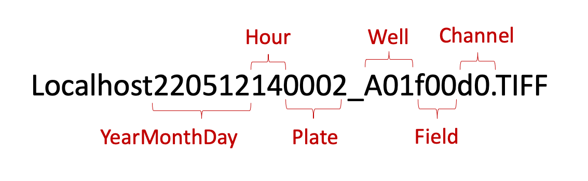

# Download CFReT data

In this module, we will present how to download the data for the CFReT project.

## Download profiles

Intermediate files and profiles can be accessed from this GitHub repository via Git LFS.
Once you have cloned this repository, run the following command:

```bash
git lfs pull
```

This will download all of the large files like SQLite and parquet which contain profile data.

## Download images

Images can be accessed upon request from the authors.

### Metadata

Metadata format for the images is as follows:


