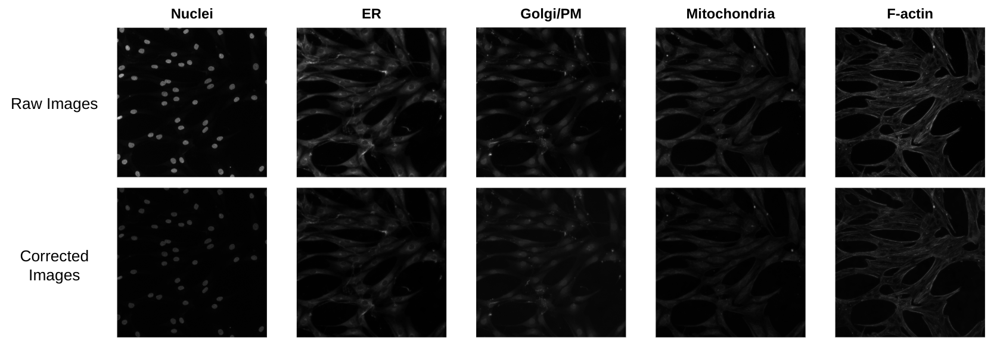
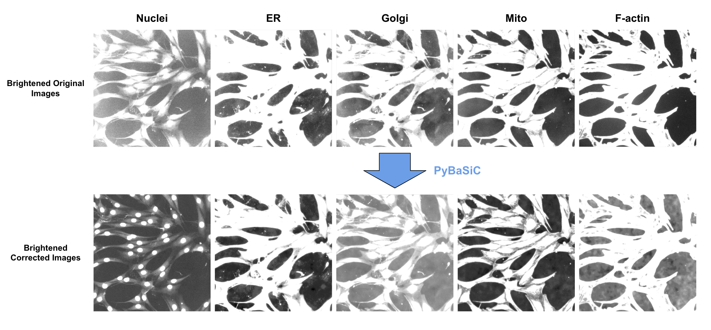

# 1. Preprocessing CFReT Data

In this module, we present our pipeline for preprocessing the CFReT pilot data.

## Illumination Correction

To correct for illumination issues within the CFReT pilot data, we use the BaSiC method that was established in an article by [Peng et al.](https://doi.org/10.1038/ncomms14836).
We specifically use the Python implementation of this method, called [PyBaSiC](https://github.com/peng-lab/BaSiCPy).

Illumination correction is an important step in cell image analysis pipelines as it helps with downstream processes like segmentation (more accuracy in segmenting shape and identifying objects to segment) and feature extraction (accurate measurements in intensity, texture, etc.).

Being able to visualize illumination errors can be hard for some datasets.
To test if illumination correction is necessary for this dataset, we brightened images using [Fiji](https://imagej.net/software/fiji/).
Through this, we did observe that there was technical variation in illumination across the images (e.g vignetting), which is a common issue for Cell Painting data (Figure 1).


> Figure 1. Image Comparison: Raw to Brightened. This figure displays the images for each channel in the same well/frame. The channel metadata (red) and Cell Painting assay stain for each channel (blue) is shown to the left of the images. The main indicator of illumination issues is seeing brighter areas, especially in the background. For example, in the `Mito` channel, you can see that on the left side, the area is brighter as compared to the top right.

After using PyBaSiC (or BaSiCPy) to correct for illumination, it is hard to tell if there was any change made to the images just by looking at them unedited (Figure 2).



> Figure 2. Comparison Between Unedited Raw and Corrected Images. This figure shows that it is very hard for the human eye to see the difference between the raw and corrected images without any editing.

By brightening the images through, there is a noticable difference in illumination between the raw and corrected images where you can tell the illumination is more even in the corrected images (Figure 3)



> Figure 3. Image Comparison: Brightened Raw Images to Brightened Corrected Images. This figure shows the difference in illumination when the raw and corrected images are brightened.

## Step 1: Install PyBaSiC

Clone the repository into 1_preprocess_data/ with 

```console
git clone https://github.com/peng-lab/PyBaSiC.git
git checkout f3fcf1987db47c4a29506d240d0f69f117c82d2b
```

**Note:** This implementation does not have package support which means that it can not be imported as you normally would. 
To correct for this, use this line of code within your "Importing Libraries" cell to be able to use the functions within the 
[notebook](1.preprocessing-data/illumcorrect-data.ipynb).

```console
import sys
sys.path.append("./PyBaSiC/")
import pybasic
```

## Step 2: Run IC on CFReT data

To perform illumination correction on the CFReT data, you will need to run the [illumcorrect-data.ipynb notebook](illumcorrect-data.ipynb).
Remember that you can update the `data_path` and `save_path` if needed.

```bash
# Run this script in terminal to segment NF1 data
bash 1.illumcorrect-data.sh
```
