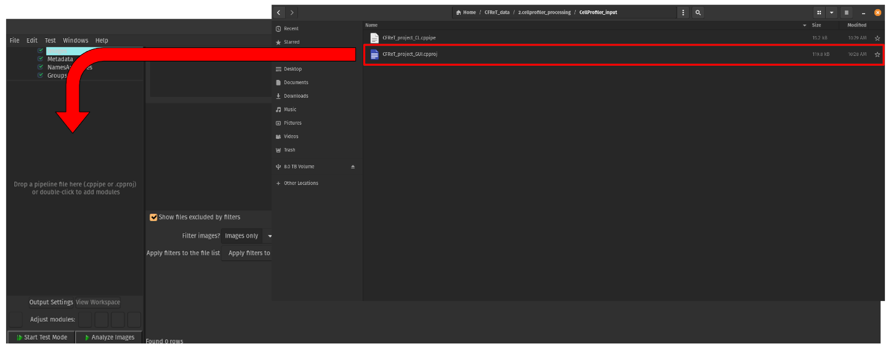
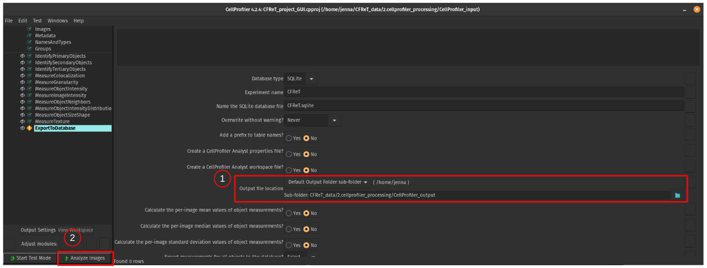

# 2. CellProfiler Segmentation and Feature Extraction

In this module, we present our pipeline for segmentation and feature extraction using [CellProfiler (CP)](https://cellprofiler.org/)

## Segmentation

To run segmentation, we use the standard approach used in CellProfiler for Cell Painting images (see https://github.com/gigascience/paper-bray2017/tree/master/pipelines and https://github.com/broadinstitute/imaging-platform-pipelines)

This standard approach is as follows:

- **IdentifyPrimaryObjects:** Identify nuclei from the `d0` channel images. This creates a group for an object called `OrigNuclei`, which includes nuclei that are a part of cells that touch an edge of the image.

- **IdentifySecondaryObjects:** Identify whole cells using the nuclei from the previous module as a base from the `d4` channel (stained for F-actin) images. 
These whole cells make up the object group called `Cells`.
Any cells that are touching at least one edge of the image will be removed along with its respective nucleus. 
This creates a new object group call `Nuclei`.

- **IdentifyTeritaryObjects:** Identify cytoplasm by subtracting out the "smaller identified objects" (`OrigNuclei`) from the "larger identified objects" (`Cells`). 
`OrigNuclei` has to be used in this module over `Nuclei` due to an error downstream in the pipeline when using the latter object where it states "Cytoplasm is not in a 1:1 relationship with other objects".
This means that the number of cytoplasm is not the same as the other objects, which would be wrong because there should be the same amount of objects (e.g the number of cells should match the number of cytoplasm and nuclei).

## Feature Extraction

To run feature extraction, the modules used are based on the ones from the [NF1 Schwann Cell CellProfiler pipeline](https://github.com/WayScience/NF1_SchwannCell_data/tree/main/CellProfiler_pipelines).
The modules used include:

- **MeasureColocalization**
- **MeasureGranularity**
- **MeasureObjectIntensity** 
- **MeasureImageIntensity**
- **MeasureObjectNeighbors**
- **MeasureObjectIntensityDistribution**
- **MeasureObjectSizeShape**
- **MeasureTexture**

For more information on these modules and the parameters within me, please reference the NF1 Schwann Cell project documentation above for the CellProfiler pipeline.
More modules can be added based on the needs of the project.

## ExportToDatabase Module

Within this module, the features for each object (e.g. nuclei, cells, and cytoplasm) are exported into a .sqlite file.

Specifically, this module is set to create one table per object type, which is the expected format for the file for the next step in the pipeline (e.g. `preprocessing features`).

--- 

## Step 1: Install CellProfiler

CellProfiler version 4.2.4 can be installed using a conda environment which can be created with the necessary packages by:

```console
# Run this command to create the conda environment for CellProfiler
conda env create -f cellprofiler_env.yml
```

To run CellProfiler, you will need to activate the environment.

```console
conda activate cp4
```

## Step 2: Run CellProfiler Pipeline on CFReT Data

Based on what you would like, you can run CellProfiler either through the command line or through the GUI.

**Note:** If you want to force overwrite, you will have to put the .cpproj or .cppipe into the CellProfiler GUI to change the parameter within the `ExportToDatabase` module, which you can see in Figure 2 below.

### Step 2a: Run through Command Line

To run CellProfiler through the command line, run the [example_cp.ipynb notebook](example_cp.ipynb).

`path_to_pipeline`(must contain "CFReT_project.cppipe" at the end), `path_to_images` (for each plate) and `path_to_output` variables need to be changed to your absolute paths on your machine.

```bash
# Run this script in terminal to segment NF1 data
bash 1.illumcorrect-data.sh
```

CellProfiler runs on CPU, and it took approximately 8 hours to run plate `localhost220512140003_KK22-05-198` and approximately 5 hours to run plate `localhost220513100001_KK22-05-198_FactinAdjusted`. 

### Step 2b: Run through GUI

Use the command `cellprofiler` to bring up the GUI when in the `cellprofiler` environment.

```console
cellprofiler
```

Once the GUI is activated, drag the [CFReT_project_GUI.cpproj](CellProfiler_input/CFReT_project_GUI.cpproj) into the left hand side box. 
This will load up the project.



> Figure 1. How to get started. this figure shows how to get a pipeline loaded into CellProfiler. This allows you to edit any module and test the pipeline if necessary.

Then, delete all of the images from the `Images` module as the path currently is for my local machine. 

Drag the images from one plate from the location you downloaded the images to from the `0.download-data` module into the `Images` module in CellProfiler.

Lastly, change the output directory in the `ExportToDatabase` module to your local machine to the `CellProfiler_output` folder using the "Default Output Folder sub-folder" and press `Analyze images` to start the process.



> Figure 2. Steps to analyze CFReT images. This figure shows the main steps needed to be taken to be able to analyze the images and getting the output to the right place.

**Note:** If you do not want to view the pop-ups from each module, click the `eye` symbol next to the module to turn it off (should have a line across the eye to indicate that the function is turned off).
