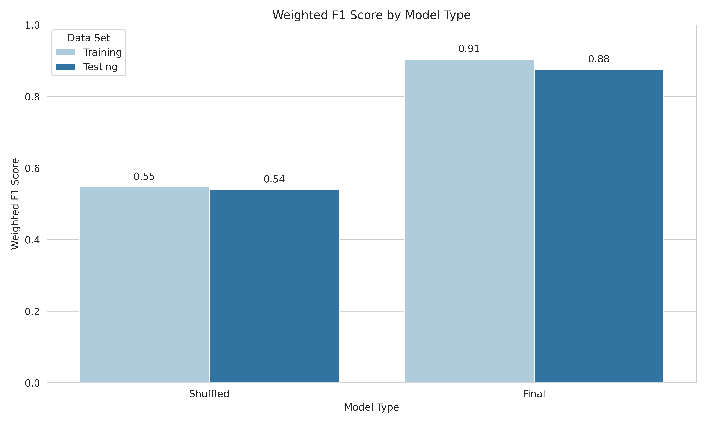

# Evaluate models

In this submodule, we perform analyses to evaluate the performances of the models based on the training, testing, and holdout splits.

## PR Curves

We generate PR curves to assess how are models are performing between the training and testing splits.

## Confusion matrices

We generate confusion matrices to evaluate how well the model is accurately predicting the binary class (otherwise known as healthy versus failing).

In the final model for all features, we see very high performance across data splits in comparison to the shuffled baseline model.

## F1 scores

We generate bar plots of the weighted F1 scores to see how well the all features model is performing.

We see high F1 scores in the final model compared to the shuffled models for training, testing, and holdout splits.

## Accuracy

We generate bar charts showing the accuracy of the models at predicting single-cells from each heart as the correct class (failing or healthy) across the data splits.

We see very high accuracy in the all features model across all of the splits.

When evaluating the accuracy from the rest and actin only models, we significantly lower accuracy which is consistent for both models.

