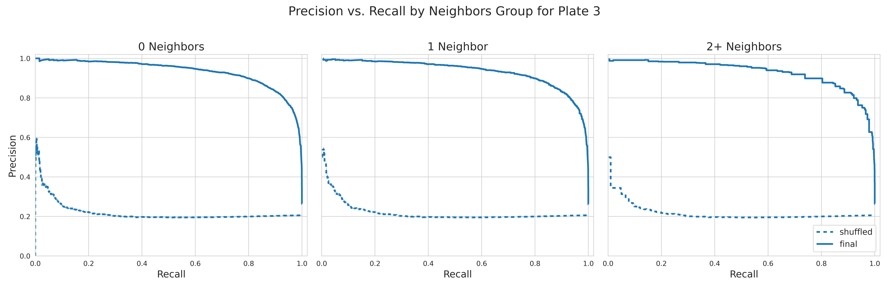

# Assess generalizability of the models

In this submodule, we perform various analysis to determine how to models we trained perform on holdout plates of data that has never been seen.
We apply the models (all features, actin only, without actin) to 3 different holdout plates.
We assess if our model detects changes in probabilities across doses for a drug from two other plates.
We are focusing on `Plate 3`, which include two completely new hearts with positive and negative controls.

## Precision-recall curves

We create PR curves for `Plate 3` only using the control (DMSO treated) cells to evaluate if the model(s) can accurately predict the failing versus healthy single-cells.
We generated a combined PR curve plot that includes the performances across the feature sets.

We concluded that using all features to train a model was most optimal.
Surprisingly, there is a very low performance when using only F-actin features, which we used as a direct representation of the traditional alpha-SMA staining protocol.
When using the rest of the features, we see high performance but still lower than using all features.

We also wanted to assess how the performance looked when there were single-cells in high confluent FOVS.
We created PR curves splitting out by the number of nuclei adjacent neighbors.

We can see very high and similar performance across the confluences/number of neighbors.

## Ridge plots

We create ridge plots using the healthy probability to show the distributions of the single-cells across healthy or failing hearts.
We show very promising results in `Plate 3` as we show failing cells being predicted as healthy with the positive control (TGFRi) treatment.
We also demonstrate that our model can detect a drug shifting failing cells to healthy.

## UMAPs

We generated UMAPs in a previous module as preliminary data exploration.
We showed very interesting results from `Plate 3` where we see different clusters for the failing control, healthy control, and TGFRi treated failing cells.

We wanted to further evaluate the above UMAP by labelling for different aspects of the data.
Firstly, we label the points using the normalized top F-actin feature from the all features final model.

We can see that within the healthy clusters at the bottom, there is variation in actin intensity.
This shows that there is more to predicting the health state of the cells than just F-actin intensity.

We then looked at the UMAP using nuclei neighbors as the label.

There is a cluster in the bottom left of the UMAP that shows more single-cells with high nuclei neighbors, which is where there was some overlap between the failing, healthy, and failing TGFRi clusters in the original UMAP.

Lastly, we labelled the UMAP using nuclei area (not normalized).

We see nuclei area tends to be higher in the failing control regions, which could be attributed to the higher proliferation which leads to higher confluence.
