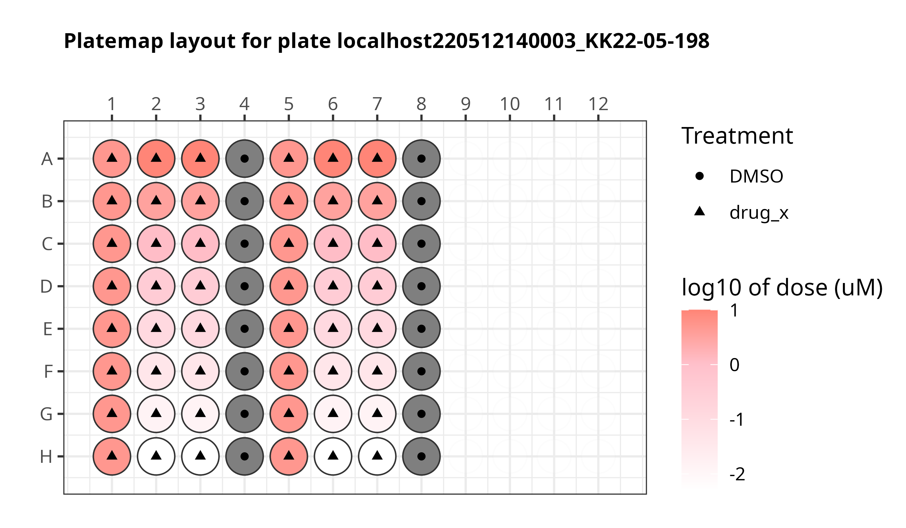
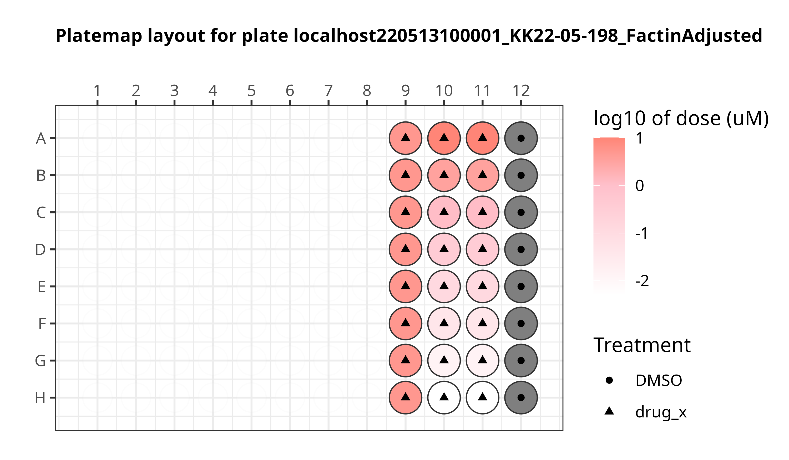

# CFReT Project

## Data

The data used in this project is a modified [Cell Painting assay](https://www.moleculardevices.com/applications/cell-imaging/cell-painting#gref) on [cardiac fibroblasts](https://www.ncbi.nlm.nih.gov/pmc/articles/PMC5588900/#:~:text=Definition%20by%20function,%2C%20and%20glycoproteins5%2C6.). 

In this modified Cell Painting, there are five channels:

- `d0` (Nuclei)
- `d1` (Endoplasmic Reticulum)
- `d2` (Golgi/Plasma Membrane)
- `d3` (Mitochondria)
- `d4` (F-actin)


## Plate maps

We applied this modified Cell Painting assay using the following plate design for the first two plates:

- **localhost220512140003_KK22-05-198**



- **localhost220513100001_KK22-05-198_FactinAdjusted**



For the third plate, we are using the following plate design:

- **localhost230405150001**


In this plate, there are only two different patients, one with a healthy heart and one that had a failing heart. 

For the fourth plate, we used the following plate design:

- **localhost231120090001**


For this fourth plate, we are looking at different patients with the same heart failure type and patients with healthy hearts. 
We want to assess if there are morphological differences between cells that come from different patients but suffer the same type of heart failure, which is dilated cardiomyopathy.

See our [platemaps](metadata/) for more details.

## Goals

The goals of this project are:
1. To identify morphology features from cardiac fibroblasts that distinguish cardiac patients. 
2. To discover a cell morphology biomarker associated with drug treatment to reverse fibrosis scarring caused by cardiac arrest.

## Repository Structure

| Module | Purpose | Description |
| :---- | :----- | :---------- |
| [0.download_data](0.download_data/) | Download CFReT pilot data | Download pilot images for the CFReT project |
| [1.preprocessing_data](1.preprocessing_data/) | Perform Illumination Correction (IC) | We use CellProfiler to perform IC on images per channel for all plates |
| [2.cellprofiler_processing](2_cellprofiler_processing/) | Apply feature extraction pipeline | We use CellProfiler to extract hundreds of morphology features per imaging channel |
| [3.process_cfret_features](3.process_cfret_features/) | Get morphology features analysis ready | Apply cytotable and pycytominer to perform single-cell merging, annotation, normalization, and feature selection |
| [4.analyze_data](4.analyze_data/) | Analyze the single cell profiles to achieve goals listed above | Several independent analyses to describe data and test hypotheses |
| [5.machine_learning](5.machine_learning/) | Generate binary logistic regression model | Train model to predict healthy or failing cells and evaluate performance |

## Create main CFReT conda environment

For all modules, we use one main environment for the repository, which includes all packages needed including installing CellProfiler v4.2.4 among other packages.

To create the environment, run the below code block:

```bash
# Run this command in terminal to create the conda environment
conda env create -f cfret_main_env.yml
```

**Make sure that the conda environment is activated before running notebooks or scripts:**

```bash
conda activate cfret_data
```

## Python and R analysis

There are two different environments used for python (preprocessing steps) and 

- [python_analysis_env](./python_analysis_env.yml): This environment is for use in python specific notebooks, like the preprocessing and analyze data modules.
- [R_analysis_env](./R_analysis_env.yml): This environment is for use in R specific notebooks, specifically for visualizing data.

You can create the environments using the code block below:

```bash
# create environment for analysis
mamba env create -f python_analysis_env.yml
```
