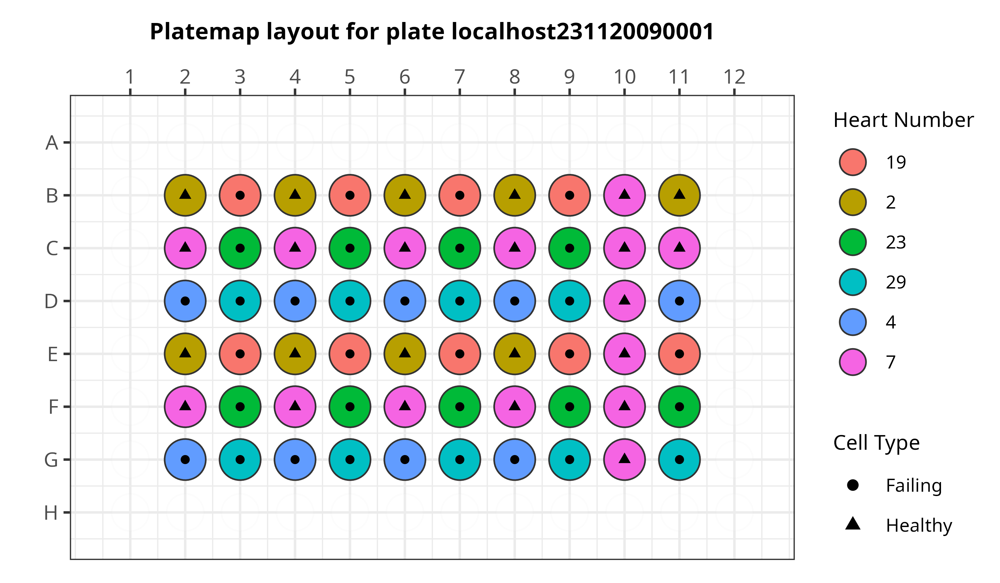

[](https://doi.org/10.5281/zenodo.13328681)

# Cell Painting predicts cardiac fibrosis

In this repository, we generate pipelines to perform image analysis, image-based profiling, and training machine learning model to predict cardiac fibrosis phenotype using non-failing and failing single cell morphological profiles.

## Goals

The goals of this project are to:

1. Comprehensively define cell-state differences between failing and non-failing cardiac fibroblast (CF) populations.
2. Accurately predict CF phenotype that can generalize and be applied to a large-drug screen to find hits that make the failing cells look healthy.

## Cell Painting

We performed a modified [Cell Painting assay](https://www.moleculardevices.com/applications/cell-imaging/cell-painting#gref) on [cardiac fibroblasts](https://www.ncbi.nlm.nih.gov/pmc/articles/PMC5588900/#:~:text=Definition%20by%20function,%2C%20and%20glycoproteins5%2C6.) from non-failing and failing human hearts. 

In this modified Cell Painting, there are five channels:

- `d0` (Nuclei)
- `d1` (Endoplasmic Reticulum)
- `d2` (Golgi/Plasma Membrane)
- `d3` (Mitochondria)
- `d4` (F-actin)


## Data

For training a logistic regression classifier, we extracted single-cell morphology profiles from CFs of different patients with the same heart failure type and patients with non-failing hearts.
We label wells from each patient as either "Failing" (failed heart) or "Healthy" (non-failing heart).
There was no treatment or perturbation applied to any of the wells in this plate.

- **localhost231120090001**



---

We utilized a secondary plate to assess the generalizability of the model.
This plate contains two different hearts, one from a non-failing patient and the other from a failing patient.
Wells are labelled as either "Failing" (failing heart) or "Healthy" (non-failing heart).
There are three different treatments:

- DMSO (control)
- drug_x
- TGRFi (TGFB inhibitor)

We applied the model to this dataset to evaluate its accuracy in predicting control cells and to observe how its predictions change in response to different treatments.

- **localhost230405150001**


Additionally, we include the pilot plates below in this repository that were not prepared using an optimized protocol, intended for further analysis that is not included in the manuscript.

- **localhost220512140003_KK22-05-198**
- **localhost220513100001_KK22-05-198_FactinAdjusted**

See our [platemaps](metadata/) for more details.

## Repository Structure

| Module | Purpose | Description |
| :---- | :----- | :---------- |
| [0.download_data](0.download_data/) | Download CFReT pilot data | Download pilot images for the CFReT project |
| [1.preprocessing_data](1.preprocessing_data/) | Perform Illumination Correction (IC) | We use CellProfiler to perform IC on images per channel for all plates |
| [2.cellprofiler_processing](2.cellprofiler_processing/) | Apply feature extraction pipeline | We use CellProfiler to extract hundreds of morphology features per imaging channel |
| [3.process_cfret_features](3.process_cfret_features/) | Get morphology features analysis ready | Apply cytotable and pycytominer to perform single-cell merging, annotation, normalization, and feature selection |
| [4.analyze_data](4.analyze_data/) | Analyze the single cell profiles to achieve goals listed above | Several independent analyses to describe data and test hypotheses |
| [5.machine_learning](5.machine_learning/) | Generate binary logistic regression model | Train model to predict healthy or failing cells and evaluate performance |

## Create CellProfiler conda environment

For modules 1 and 2, we use one CellProfiler environment for the repository, which includes all packages needed including installing CellProfiler v4.2.4 among other packages.

To create the environment, run the below code block:

```bash
# Run this command in terminal to create the conda environment
conda env create -f cfret_cp_env.yml
```

**Make sure that the conda environment is activated before running CellProfiler related notebooks or scripts:**

```bash
conda activate cfret_data
```

## Python and R analysis

There are two different environments used for python (preprocessing steps) and 

- [python_analysis_env](./python_analysis_env.yml): This environment is for use in python specific notebooks, like the preprocessing and analyze data modules in modules 3 and 4.
- [R_analysis_env](./R_analysis_env.yml): This environment is for use in R specific notebooks, specifically for visualizing data.

**NOTE:** For module 5 where we train a machine learning model, there is a specific environment for that module that can be installed which is described in the [README](./5.machine_learning/README.md).

You can create the environments using the code block below:

```bash
# create environment for analysis
mamba env create -f python_analysis_env.yml
mamba env create -f R_analysis_env.yml
```

**Make sure that the conda environment is activated before running related notebooks or scripts:**

```bash
conda activate python_analysis_cfret
# OR
conda activate R_analysis_cfret
```
